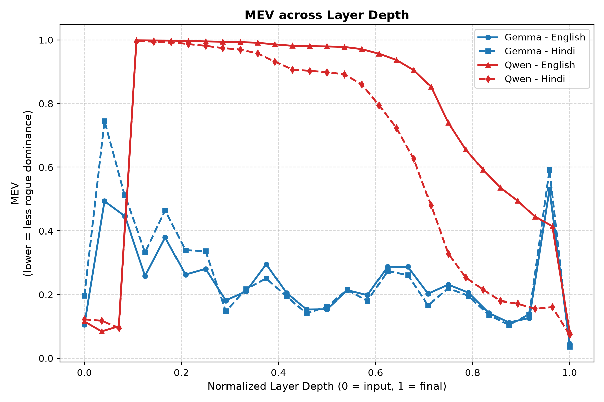
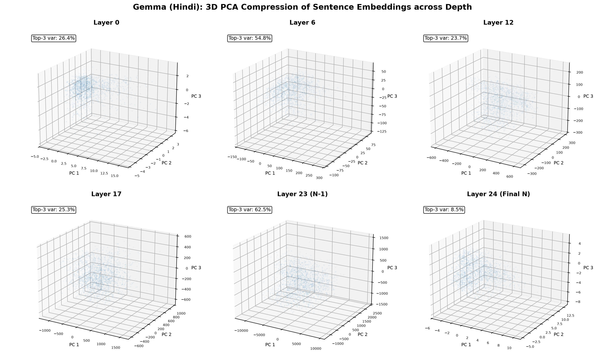
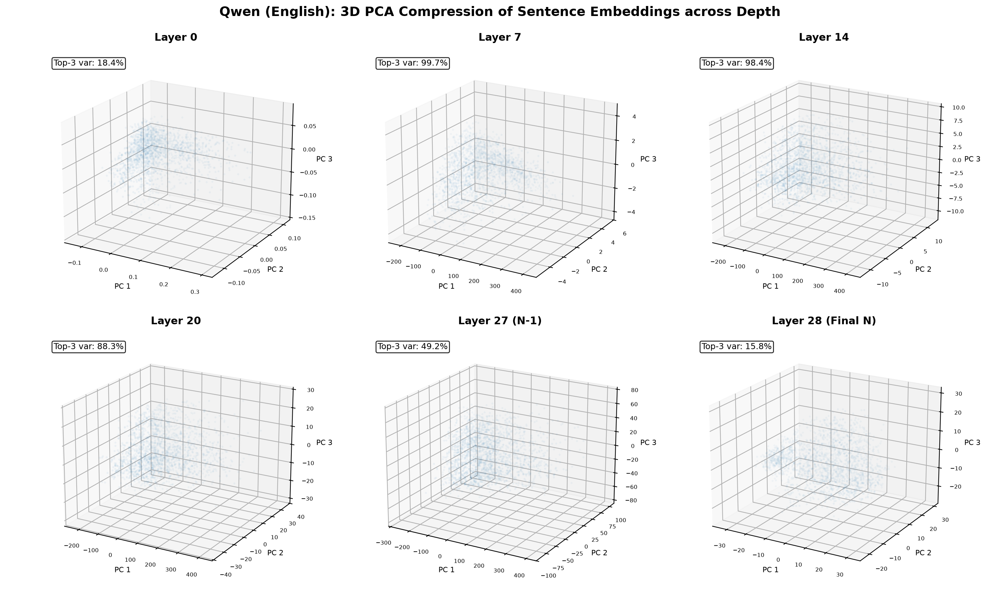
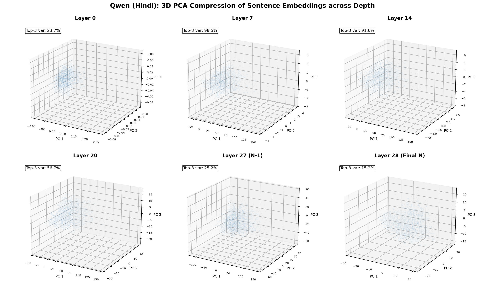

# Layer-wise Isotropy of Multilingual Sentence Embeddings on BPCC (English vs Hindi)

We measure how two embedding models organize their representation space at each
layer, and whether they treat English and Hindi differently. Every measurement
uses the same random parallel subset of BPCC, so any gap between the two
languages comes from the model, not from the text.

## Dataset

The Bharat Parallel Corpus Collection (BPCC), released by AI4Bharat, is a large
collection of English-Indic sentence pairs. We use its Wikipedia split for Hindi
(`wiki/hin_Deva.tsv`), where each row holds an English sentence and its Hindi
translation. From roughly 40,000 pairs we draw a fixed random sample of 10,000,
which gives us 10,000 English sentences and the 10,000 Hindi sentences that mean
the same thing. Because the two sides are exact translations, differences we see
between them reflect how a model encodes the two languages rather than any
difference in what is being said.

## Models and method

We compare EmbeddingGemma-300m (24 layers plus the input embedding, hidden size
768) and Qwen3-Embedding-0.6B (28 layers plus the input embedding, hidden size
1024). Both run in raw mode with no task prompt, and we read the hidden states
after every layer.

At each layer we compute attention-masked mean-pooled sentence representations
across the 10,000 parallel sentences. For an input sequence with hidden states
$\mathbf{h}_1, \dots, \mathbf{h}_T$ and binary attention mask $M \in \{0, 1\}^T$,
the sentence embedding is $\mathbf{s} = \frac{\sum_i M_i \mathbf{h}_i}{\sum_i M_i}$.
This yields an $(N, d)$ representation matrix at every depth, corresponding to the
sentence vectors evaluated in dense retrieval. On each representation matrix we
compute four intrinsic geometric metrics:

- IsoScore: how evenly variance is spread across all dimensions (Rudman et al.,
  2022). 0 is fully anisotropic, 1 is fully isotropic.
- Average Random Cosine Similarity: one minus the mean absolute cosine of random
  sentence pairs (Ethayarajh, 2019). Values near 0 indicate that sentences
  collapse into a narrow directional cone; values near 1 indicate wide angular
  dispersion.
- ID Score: intrinsic dimensionality (Levina-Bickel MLE) divided by the hidden
  size.
- MEV (Maximum Explained Variance ratio): the fraction of variance captured by
  the single largest principal component ($\lambda_1 / \sum \lambda_k$, formerly
  referred to as SVD ratio). A high value signifies rogue dimension dominance
  along one axis.

We run this for each of the four combinations: Gemma-English, Gemma-Hindi,
Qwen-English, and Qwen-Hindi. For downstream reporting and LaTeX inclusion, all
figures are saved both as high-resolution PNGs and as vector PDF files.

## Results

### IsoScore

Both models are strongly anisotropic in intermediate layers. Gemma sits below
0.05 across its depth, drops to 0.0033 at penultimate layer 23, and then surges
to 0.196 (English) and 0.214 (Hindi) at final layer 24. Qwen collapses even
harder: from layer 3 onward its IsoScore is practically 0.0000, recovering
slightly in deep layers before jumping to 0.063 (English) and 0.069 (Hindi) at
output layer 28. The final layer in both models marks a significant isotropic
recovery.

### MEV (Maximum Explained Variance Ratio)

MEV tracks the fraction of total variance consumed by the top principal component.
Qwen demonstrates severe single-axis dominance: between layers 3 and 10 a single
axis holds over 99.5% of all variance (reaching 99.9% at layers 3 to 5),
collapsing the entire sentence embedding space onto a line. This ratio gradually
relaxes in later layers and drops to 0.084 (English) and 0.074 (Hindi) at the
output layer. Gemma maintains lower variance concentration through the middle
depths (0.15 to 0.38), spikes at penultimate layer 23 to 0.530 (English) and
0.592 (Hindi), and drops to 0.046 (English) and 0.036 (Hindi) at output layer 24.

### Average Random Cosine Similarity

Values near zero mean sentence vectors point in nearly identical directions,
forming an acute directional cone. In Qwen, sentence vectors form an extreme cone
through layers 3 to 15 (values between 0.0003 and 0.005, corresponding to random
sentence cosine similarities above 0.995). Gemma tightens through the middle
layers and reaches peak collapse at layer 23 (0.0038 for English, 0.0030 for Hindi).
At the final layer, both models break the cone: Gemma jumps to 0.506 (English)
and 0.485 (Hindi), while Qwen surges to 0.462 (English) and 0.328 (Hindi). The
output layer is where angular dispersion is enforced for retrieval.

### ID Score

Intrinsic dimensionality remains low throughout the network (2% to 6% of ambient
dimension), indicating that sentence embeddings inhabit a low-dimensional
manifold at every depth. Gemma displays slightly higher intrinsic dimensionality
than Qwen through intermediate layers (0.035 to 0.042 vs. 0.022 to 0.030).
English and Hindi exhibit closely aligned manifold dimensions across both models.

### PCA Compression (3D Point Cloud Progression)

For each model and language combination, we project the sentence representations
onto their top three principal components across model depth, deliberately pairing
the penultimate layer ($N-1$) directly alongside the final output layer ($N$) to
isolate the phenomenon of final-layer normalization and contrastive dispersion
(layers 0, 6, 12, 17, 23, 24 for Gemma; layers 0, 7, 14, 20, 27, 28 for Qwen).

#### EmbeddingGemma (English)

The input layer displays an isotropic distribution with top-3 variance share of
21.4%. Intermediate layers contract into an elongated cluster (top-3 variance
reaches 53.9% at layer 6). At penultimate layer 23 ($N-1$), representations
remain compressed (56.7% top-3 variance) with coordinate magnitudes stretching
past 10,000 on PC 1. At final layer 24 ($N$), the output normalization and
contrastive projection redistribute representations into a bounded, spherical
cloud, dropping top-3 variance share down to 8.9%.

#### EmbeddingGemma (Hindi)

Hindi follows an identical geometric progression: an initial spread at layer 0
(24.6% top-3 variance), tightening along dominant axes across layers 6 to 17
(56.4% and 29.5% top-3 variance). At penultimate layer 23 ($N-1$), the sentence
cloud exhibits severe directional stretching (62.1% top-3 variance). At final
layer 24 ($N$), output normalization reconstitutes a spherical distribution with
balanced dispersion, reducing top-3 variance share to 9.3%.

#### Qwen3-Embedding (English)

Qwen displays extreme collapse in early-to-mid layers: at layer 7, top-3
variance share reaches 100.0%, reflecting the 99.6% single-axis MEV dominance.
By penultimate layer 27 ($N-1$), the cloud has begun relaxing (41.5% top-3
variance) but remains elongated. At final layer 28 ($N$), the dominant axis is
suppressed, and representations expand into 3D volume with top-3 variance share
dropping to 11.0%.

#### Qwen3-Embedding (Hindi)

Hindi sentence embeddings in Qwen mirror the English trajectory: a concentrated
line at layer 7 (98.2% top-3 variance), gradual multi-axis opening through
layers 14 to 20, and a partially compressed state at penultimate layer 27 ($N-1$,
20.1% top-3 variance). At final layer 28 ($N$), the cloud opens into a wide,
isotropic configuration with top-3 variance share falling to 12.0%.

## Takeaways

- Both models compress sentence representations into a narrow, low-dimensional
  cone across their middle layers and then reopen the space at the output layer.
  This reflects contrastive fine-tuning objectives, which enforce hyperspherical
  uniformity at the output layer for cosine-similarity retrieval.
- Qwen exhibits acute single-axis collapse (MEV > 99.5%) in its early-to-middle
  depths before gradually decompressing, whereas Gemma maintains a more moderate
  variance distribution until an acute spike at penultimate layer 23 ($N-1$).
- In both architectures, the transition from layer $N-1$ to layer $N$ is where the
  directional cone is eliminated and spherical isotropy is restored.
- English and Hindi representations display remarkably consistent geometry layer
  by layer across both models, confirming that representation space organization
  is largely language-invariant under parallel semantic content.

## Artifacts

- Quantitative metrics: `results/BPCC_hin_Deva_<model>_<lang>/metrics.csv` and
  `metrics.json`
- 3D PCA compression figures:
  `results/BPCC_hin_Deva_<model>_<lang>/pca_compression.png` and
  `pca_compression.pdf`
- Layer-wise metric comparison plots:
  `results/figures/<metric>_layerwise.png` and `<metric>_layerwise.pdf`
  (including `isoscore_layerwise.*`, `mev_layerwise.*`,
  `avg_cosine_similarity_layerwise.*`, `id_score_layerwise.*`)
