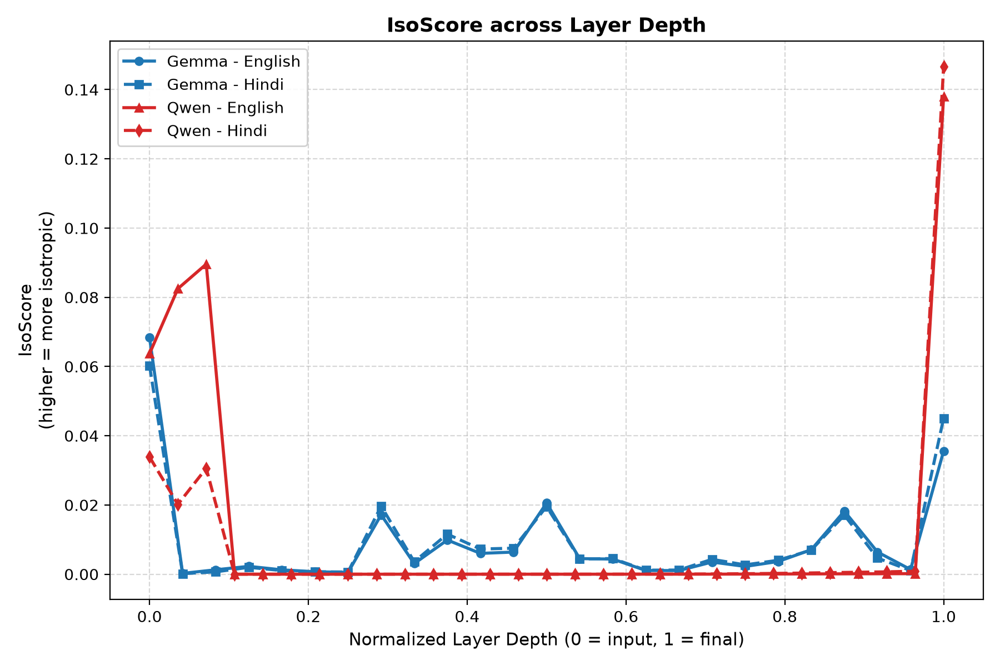
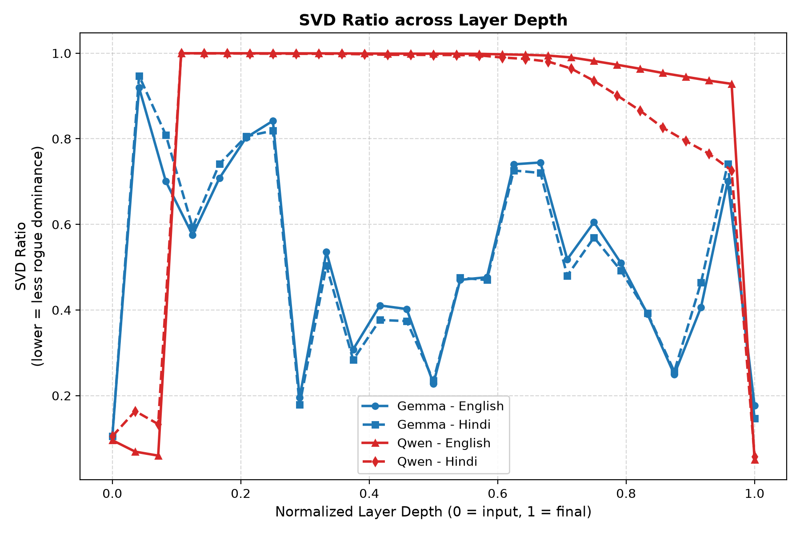
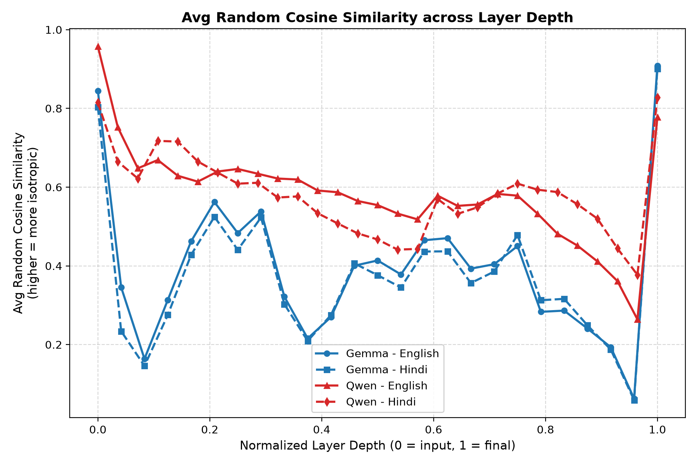
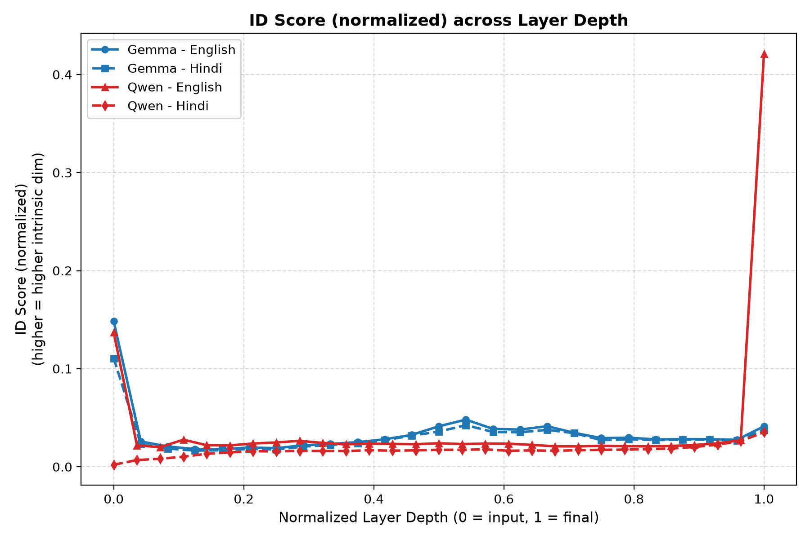
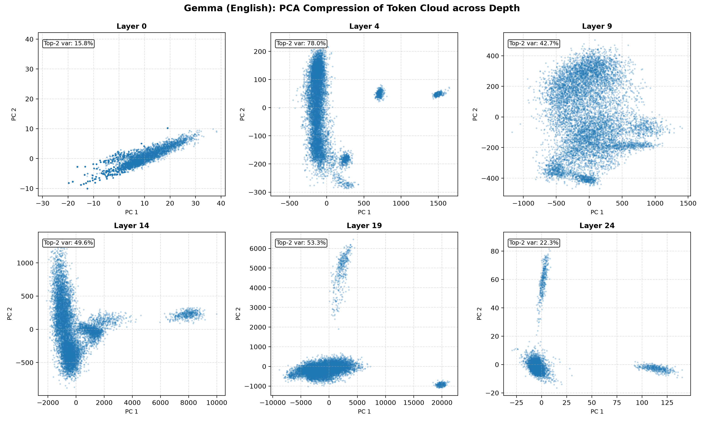

# Layer-wise Isotropy of Multilingual Embeddings on BPCC (English vs Hindi)

We measure how two embedding models organize their representation space at each
layer, and whether they treat English and Hindi differently. Every measurement
uses the same random parallel subset of BPCC, so any gap between the two
languages comes from the model, not from the text.

## Dataset

The Bharat Parallel Corpus Collection (BPCC), released by AI4Bharat, is a large
collection of English-Indic sentence pairs. We use its Wikipedia split for Hindi
(`wiki/hin_Deva.tsv`), where each row holds an English sentence and its Hindi
translation. From roughly 40,000 pairs we draw a fixed random sample of 10,000,
which gives us 10,000 English sentences and the 10,000 Hindi sentences that mean
the same thing. Because the two sides are exact translations, differences we see
between them reflect how a model encodes the two languages rather than any
difference in what is being said.

## Models and method

We compare EmbeddingGemma-300m (24 layers plus the input embedding, hidden size
768) and Qwen3-Embedding-0.6B (28 layers plus the input embedding, hidden size
1024). Both run in raw mode with no task prompt, and we read the hidden states
after every layer.

At each layer we treat the individual token vectors as a point cloud (we do not
pool them into sentence vectors), sampling up to 10,000 token vectors per layer.
On each cloud we compute four metrics:

- IsoScore: how evenly variance is spread across all dimensions. 0 is fully
  anisotropic, 1 is fully isotropic.
- Average Random Cosine Similarity: one minus the mean absolute cosine of random
  token pairs. Low values mean the tokens share a common direction.
- ID Score: intrinsic dimensionality (Levina-Bickel MLE) divided by the hidden
  size.
- SVD Ratio: the fraction of variance held by the single largest principal
  component. A high value means one dominant "rogue" dimension.

We run this for each of the four combinations: Gemma-English, Gemma-Hindi,
Qwen-English, Qwen-Hindi.

## Results

### IsoScore

Both models are strongly anisotropic once past the input layer. Gemma sits near
0.01 across its depth and only recovers a little at the last layer (0.036 for
English, 0.045 for Hindi). Qwen is more extreme: from layer 3 onward its IsoScore
is effectively 0, and it rises only at the final layer (about 0.14). The English
and Hindi curves lie almost on top of each other for both models.

### SVD Ratio

This plot explains Qwen's flat-zero IsoScore. Between layers 3 and 27 a single
principal component holds around 99.9% of the variance, so the whole token cloud
lies on one axis. The final layer breaks this open and drops the ratio to about
0.05. Gemma never collapses this hard: its ratio swings between roughly 0.2 and
0.95 through the network and also falls at the last layer.

### Average Random Cosine Similarity

Values well below 1 mean the tokens point in a shared direction, that is, they
form a narrow cone. Both models tighten through the middle layers (Gemma dips to
about 0.06 near layer 23, Qwen stays around 0.5 to 0.6) and then open up sharply
at the final layer (Gemma about 0.90, Qwen about 0.78 to 0.83). The output layer
is where directions get redistributed.

### ID Score

Intrinsic dimensionality stays low throughout, a few percent of the hidden size,
so the representations live on a thin manifold at every depth. The clearest
English-Hindi gap in the whole study shows up here. At Qwen's final layer English
reaches 0.42 while Hindi stays at 0.035, and at the input layer English is 0.14
against Hindi's 0.002. Hindi tokens occupy a lower-dimensional manifold at both
ends of the network.

### PCA compression

For each model and language we project the token cloud onto its top two principal
components at six depths (one such figure per combination is saved alongside its
metrics). The input layer shows a broad, rounded spread. The middle layers
collapse toward a line or a tight blob, which matches the high SVD Ratio there,
and the final layer spreads out again. The picture is the same story the metrics
tell, seen directly.

## Takeaways

- Both models squeeze tokens onto a narrow, low-dimensional cone in their middle
  layers and then reopen the space at the output layer. This is the usual pattern
  for contrastively trained embedding models, which only need the final layer to
  be well spread for cosine similarity.
- Qwen's mid-network collapse is far more severe than Gemma's. For most of its
  depth a single dimension carries nearly all the variance.
- English and Hindi geometry is nearly identical layer by layer, with one
  exception: Hindi consistently sits on a lower-dimensional manifold, most
  visibly at Qwen's input and output layers.

The saved metrics (`metrics.csv` and `metrics.json`) and token clouds
(`embeddings.npz`) for each combination are under `results/`, and the four
comparison plots are in `results/figures/`.
